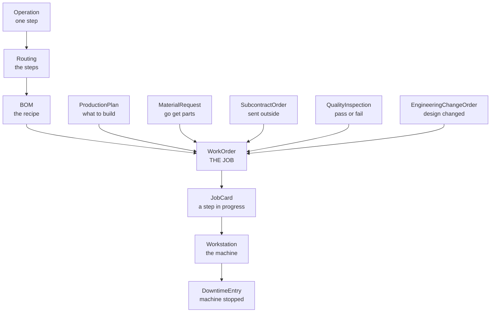
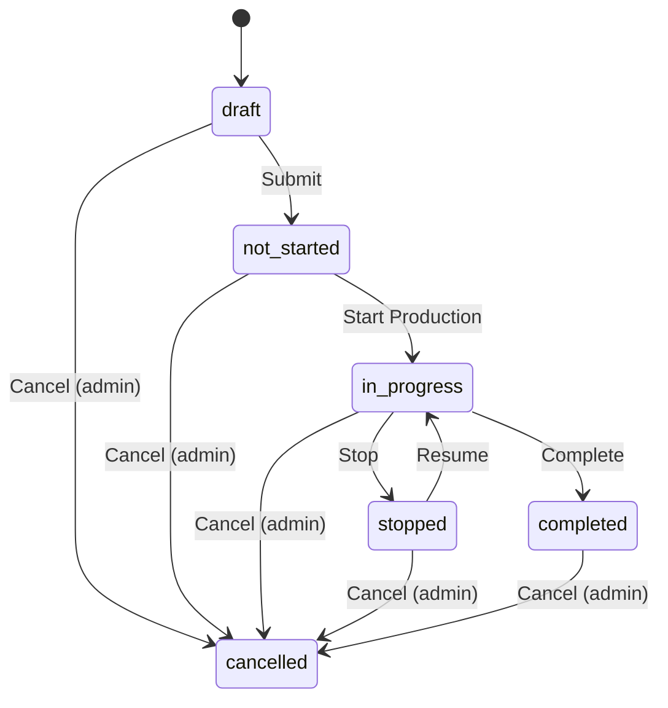
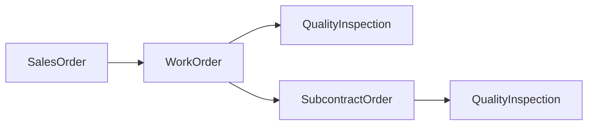

# Production Seat — How the Entities Connect

*Read from the running platform via `/api/schemas` and the MCP catalogue. Counts as of **2026-09-22** on Suryodaya — the database is shared, so expect drift. Sources: `agentswitch-platform-reference.md` §§2, 5–9, 13; `GAP_REPORT.md`. Written with Claude (AI-assisted).*

The Production seat owns 17 tables, and **WorkOrder sits in the middle of all of them**. Everything else either tells a work order how to be built, records work done against it, or reports a problem with it. Three links you would expect to exist do not work.

---

## 1. The map

Read it top to bottom: the things above WorkOrder say **how to build it**, the things below say **what happened while building it**, and the three on the sides report **problems with it**.

---

## 2. What the seat can reach

Three gates, each narrowing the one before.

**Gate 1 — domains.** `allowed_apps: ["manufacturing", "agent", "crm"]`

| Domain | Example tables | Reachable |
|---|---|---|
| manufacturing — **ours** | the 17 below | yes |
| agent — our agent's own workspace | AgentMemory, AgentSession | yes |
| crm — the shared customer spine | Deal, Party | yes |
| core — shared basics | Item, Company | yes |
| inventory | StockEntry, Warehouse | **403** |
| payroll | SalarySlip | **403** |
| contracts, email, and 20 more | | **403** |

**67 tables visible · 315 MCP tools · out of 425 tables and 27 domains on the platform.**

**Gate 2 — verbs.** `roles: ["manufacturing_user", "user", "agent_user", "sales_viewer"]`

On `WorkOrder` our role holds `read`, `create`, `write`, `submit` — and **not `cancel`, not `delete`**. That is the seat, not a defect, and it is why "cancel this work order" must be a refusal.

**Gate 3 — rows.** Everything is filtered to our own `company_id`.

> **The MCP trap.** Over MCP a forbidden tool and a misspelled tool are indistinguishable — both return `Unknown tool`. `SalarySlip.list` and `NoSuchEntity.list` give the identical error. Only REST separates them: 403 means a real limit, 404 means an invented name. This is why `seat_capability` falls back to REST.

---

## 3. The 17 tables

`kind` says how a table behaves: **record** = master data, no workflow · **transaction** = moves through a state machine · **config** = a settings singleton.

| Table | kind | Fields | Child rows | Rows live | Agent uses it |
|---|---|---:|---|---:|---|
| **WorkOrder** | transaction | 28 | — | 133 | yes |
| **JobCard** | transaction | 33 | `materials_consumed` | 329 | yes |
| **BOM** | record | 22 | `materials`, `operations` | — | yes |
| **ProductionPlan** | transaction | 10 | `items`, `material_requests` | — | **no** |
| **QualityInspection** | transaction | 16 | `parameters` | — | yes |
| **SubcontractOrder** | transaction | 18 | `supplied_materials`, `received_items` | — | yes |
| **MaterialRequest** | transaction | 9 | `items` | — | yes |
| **EngineeringChangeOrder** | transaction | 15 | `material_changes`, `operation_changes`, `affected_work_orders` | — | yes |
| **Routing** | record | 8 | `operations` | — | **no** |
| **Operation** | record | 6 | — | — | **no** |
| **Workstation** | record | 11 | — | 14 | yes |
| **DowntimeEntry** | record | 10 | — | 100 | yes |
| **ChangeoverTime** | record | 8 | — | — | **no** |
| **Batch** | record | 13 | — | — | **no** |
| **SerialNumber** | record | 10 | — | — | **no** |
| **ManufacturingPreferences** | config | 14 | — | 1 | **no** |
| **QualityPreferences** | config | 9 | — | 1 | **no** |

**9 of 17 in use. 8 untouched.**

In plain English:

| Table | What it is |
|---|---|
| **WorkOrder** | "Make 120 of these by the 25th." The job. |
| **BOM** | The recipe — what parts go in. |
| **Routing** | The path through the factory. |
| **Operation** | One single step. "Laser cut." |
| **JobCard** | One step being worked, on the floor. |
| **Workstation** | The machine or bench. |
| **ProductionPlan** | Everything we need to build next month. |
| **MaterialRequest** | "We need these parts — go get them." |
| **DowntimeEntry** | A machine stopped: when, how long, why. |
| **QualityInspection** | We checked the parts. Passed or failed. |
| **EngineeringChangeOrder** | The design changed — which jobs does it hit? |
| **SubcontractOrder** | We cannot do this step — send it to a vendor. |
| **Batch** | A group of parts made together. |
| **SerialNumber** | One specific part, tracked on its own. |
| **ChangeoverTime** | How long to switch a machine from A to B. |
| **ManufacturingPreferences** | Factory settings. |
| **QualityPreferences** | Quality-check settings. |

---

## 4. The links, by column name

Tables connect through **link fields** — a column holding another table's id. In the schema each one carries a `to` naming its target, and those `to` values *are* the relationship graph.

| From | Column | Points at |
|---|---|---|
| WorkOrder | `item_id` **(required)** | Item |
| WorkOrder | `bom_id` | BOM |
| WorkOrder | `sales_order_id` | SalesOrder — **link dead, see §7** |
| WorkOrder | `company_id` | Company |
| WorkOrder | `production_plan_id` | ProductionPlan |
| WorkOrder | `target_` / `source_` / `scrap_warehouse_id` | Warehouse — **unreadable, see §7** |
| WorkOrder | `design_file_id`, `project_id` | outside this seat |
| JobCard | `work_order_id`, `workstation_id` | WorkOrder, Workstation |
| MaterialRequest | `work_order_id` | WorkOrder |
| SubcontractOrder | `work_order_id`, `vendor_id` | WorkOrder, Party |
| QualityInspection | `reference_id` | WorkOrder (generic reference) |
| DowntimeEntry | `workstation_id`, `work_order_id`, `job_card_id` | all three, any may be null |
| EngineeringChangeOrder | `affected_work_orders[].work_order_id` | WorkOrder, via child rows |
| BOM | `materials[].item_id` | Item, via child rows |
| Routing | `operations[]` | Operation, via child rows |
| ChangeoverTime | `workstation_id` | Workstation |

### Other WorkOrder fields worth knowing

- **Quantities:** `qty` (required), `produced_qty`, `scrap_qty`
- **Dates:** `planned_start_date`, `planned_end_date`, `actual_start_date`, `actual_end_date`
- **Time:** `total_operation_time`, `actual_operation_time`
- **Cost:** `expected_cost`, `actual_cost`, `wip_account`
- **Selects:** `production_strategy` (`make_to_order` | `make_to_stock`), `priority` (`low` | `medium` | `high` | `urgent`)
- **Flags:** `quality_inspection_required`, `notes`

---

## 5. State machines

**77 of the 425 platform entities carry a flow.** Six of ours do. A transaction does not move by writing its `status` column — it moves through a named transition tool, and each transition names the role allowed to fire it.

### WorkOrderFlow — the one that matters

**Every** `Cancel` edge requires role `admin`. Team 04 cannot cancel a work order through any door.

`draft` is the only status whose dates this seat may write. After `Submit` the dates lock — which is why the agent writes dates on drafts and proposes the rest.

### WorkOrder carries two independent state fields

| Field | Type | Values |
|---|---|---|
| `status` | state | driven by WorkOrderFlow above |
| `approval_status` | select | `not_required`, `pending_approval`, `approved`, `rejected` |

Driven by a separate tool, `WorkOrder.approval.submit`. **Do not conflate them.** An order can be `in_progress` *and* `pending_approval` at the same time.

### The other five flows

| Flow | States |
|---|---|
| `JobCardFlow` | `open` → `in_progress` → `completed`; `cancelled` from open or in_progress |
| `ProductionPlanFlow` | `draft` → `submitted` → `in_progress` → `completed` |
| `QualityInspectionFlow` | `draft` → `in_progress` → `completed` |
| `SubcontractOrderFlow` | `draft` → `submitted` → `materials_sent` → `in_progress` → `received` → `quality_check` → `completed` (also `received` → `completed` direct) |
| `MaterialRequestFlow` | `draft` → `submitted` → `partially_ordered` / `ordered` → `received` |
| `ECOFlow` | `draft` → `submitted` → `under_review` → `approved` → `implemented`; `rejected` from draft or under_review |

**Every** `Cancel` on WorkOrder, ProductionPlan, SubcontractOrder and MaterialRequest, and **every** approve/reject on ECOFlow, requires `admin`.

> **What this means for the agent.** A large share of the "just fix it" actions in this domain are admin-gated. An agent honest about its seat will often land on *"I cannot do this — here is who must."* That is a correct answer, not a failure.

---

## 6. Creating one record from another

`make_from` / `<Source>.make.<Target>` copies fields across automatically and accepts overrides. Chains available to this seat:

Plus bulk creation from a plan, through the endpoints below:

- `ProductionPlan` → many `WorkOrder`
- `ProductionPlan` → many `MaterialRequest`

## The nineteen manufacturing endpoints

Beyond plain CRUD. The reference calls these **"the seat's real leverage."** The agent uses two.

**Names are underscored, and MCP-prefixed.** The REST paths are hyphenated, but the tool names this seat
calls are not: `endpoint.manufacturing.exception_cockpit`, never `exception-cockpit`. A hyphenated name is
an invented capability and 404s. Verified against `tools/list` on Suryodaya, 2026-09-22.

| `endpoint.manufacturing.…` | What it gives | Used |
|---|---|---|
| `finite_schedule` | Lateness, causes, projected finish, per-workstation load | **yes** |
| `check_stock_availability` | Shortages for an order or a BOM+qty | **yes** |
| `exception_cockpit` | A pre-ranked triage feed — 32 live items, severity set | no |
| `genealogy` | Full trace from a batch or serial **code** (one `code` string, not ids) | no |
| `work_instructions` | Revision, drift and acknowledgement for one `job_card_id` | no |
| `work_instructions.acknowledge` | Operator signed off on a revision | no |
| `generate_production_plan` | Build a plan from demand | no |
| `create_work_orders_from_plan` | Turn a plan into jobs | no |
| `create_material_requests` | Turn a plan into parts orders | no |
| `reschedule_jobs` | Move job cards | no |
| `job_traveler`, `shop_floor.job_card`, `qr` | Shop-floor paperwork for one job | no |
| `kpis`, `work_order_wip`, `overhead_rates.compute` | Aggregates and costing | no |
| `issue_action` | Act on a raised issue | no |
| `start_recall`, `send_recall_notice` | Recall workflow, downstream of `genealogy` | no |

`finite_schedule` already computes lateness, so the agent's value is not recomputing it — it is the
judgement and the state change on the end: what to reschedule, what it blocks, what must be escalated.

> **Several of these report permissions per section rather than failing.** `exception_cockpit` returns a
> `lane_states` map in which **two of four lanes are `permission_denied`** for this seat (`shortages`,
> `automation_failures`); `genealogy` returns one too. A tool built on either must read that field, or it
> will present a half-blind answer as a complete one.

---

## 7. The three broken links

The map in §1 is what works. These three are the holes, and each one changes what the agent can honestly say.

**1. Work orders do not link to each other — in this data.**
`supplies_work_order_id` is a real, writable column, offered on `WorkOrder.create`, `WorkOrder.update` and
`SalesOrder.make.WorkOrder`, and accepted as a `.list` filter. It is simply never filled: **0 of 133** on
Suryodaya and **0 of 77** on Keystone (2026-09-22). So "what does this job block?" cannot be looked up — it
has to be inferred by matching BOM parts. That is why the agent reports results as *potential* consumers,
never as *blocked*: stock or another order may already cover the demand.

Not a platform defect — a sparse dataset. Six of thirteen `WorkOrder` relationships are empty on every row
(`design_file_id`, `production_plan_id`, `project_id`, `quality_issue_id`, `routing_id`,
`scrap_warehouse_id`, `supplies_work_order_id`), while `bom_id`, `item_id`, `company_id` and
`target_warehouse_id` are filled on all 133. The demo data populates the core path and leaves the
side-branches blank. **If `supplies_work_order_id` is ever populated, `downstream_impact` can report
confirmed links instead of inferring potential ones.**

**2. Warehouses are linked but unreadable.**
`WorkOrder` points at three warehouses — target, source and scrap. `/api/Warehouse` returns **403**. The ids and their display names come through on the work order; the table behind them does not.

**3. The customer link was dead; it is alive again.**
`WorkOrder.sales_order_id` holds a real id on 65 of 133 orders on Suryodaya and 17 of 77 on Keystone.
`SalesOrder` read was withdrawn from this seat on **20 September 2026** (bug **N140**) and **restored on
22 September** — `SalesOrder.list`, `.get` and `.make.WorkOrder` are back in the catalogue and readable on
both instances, re-verified 2026-09-22. Customer exposure is traceable again. `SalesOrder.update` remains
absent, which is what makes a request to move a delivery date a refusal case rather than an unreachable one.

One more worth knowing: the platform has **no field-level permission**. Access is granted per whole table, so an agent that can read a table reads every row and every column of it.

---

## 8. Where the gaps are

Eight tables and seventeen endpoints are untouched. Each is a question the seat could answer and currently
cannot — but **having the table is not the same as having the joins**. Every row below was checked against
live data on 2026-09-22, and two of the six do not survive that check.

| Question it unlocks | Needs | Buildable? |
|---|---|---|
| "This part came back faulty — trace it." | `genealogy` (one `code`), Batch, SerialNumber, JobCard | **Yes — strongest.** Every FK 100% filled; `genealogy` returns `upstream`/`downstream`/`recipients` |
| "Why does this machine lose time switching jobs?" | ChangeoverTime, Workstation, JobCard | **Yes.** ChangeoverTime → workstation / from_item / to_item all 100/100 |
| "Is the operator on the current revision?" | `work_instructions` | **Yes.** Takes `job_card_id`, returns `revision`, `drift`, `acknowledgement` |
| "What should I look at this morning?" | `exception_cockpit` | **Half.** 32 live items, but 2 of 4 lanes are `permission_denied` — must be reported, not hidden |
| "Plan next month's production." | ProductionPlan + the 3 plan endpoints | **Weak.** 100 plans and all 3 endpoints exist, but `WorkOrder.production_plan_id` is 0/133: plans link to no existing order |
| "What is the standard path for this product?" | Routing, Operation, BOM | **No.** `Operation.routing_id` is **0/100** — operations are not attached to routings, so a routing's steps cannot be walked |

`BOM.routing_id` is 63/100 and `Routing.item_id` is 88/100, so product → BOM → routing resolves. The chain
breaks at the last hop, which is the one that matters: a routing with no operations answers nothing.

---

## Appendix — live counts, Suryodaya, 2026-09-18

| Metric | Value |
|---|---|
| WorkOrder, total | 123 |
| — completed | 46 |
| — **late** (open and past planned end) | **53** |
| — in progress | 19 |
| — not started | 38 |
| — with cost recorded | 46 |
| — with `total_operation_time > 0` | **0** ← suspected defect |
| JobCard | 329 (180 completed) |
| DowntimeEntry | 100 |
| Workstations in the load report | 14 |
| Exception-cockpit items | 32 (28 quality, 4 subcontract) |
| Finite-schedule, 21-day horizon | 61 orders — 53 late, 8 on time |
